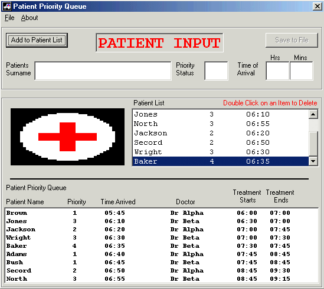



## Priority Queue

### Description

HELP WITH PRIORITY QUEUES. This small application was inspired by the request for help by R Al-shaer. Imagine a number of patients waiting in an emergency room of a local hospital. Priority is related to the seriousness of the patient's condition.

(1 = most serious, 4 = least serious).

We assume that a doctor spends 60 minutes with a patient whose priority is 1, 45 minutes for priority 2, 30 minutes for priority 3 and 15 minutes with a patient whose priority is 4.

The patient's treatment is not interrupted, even if a more serious case arrives. Two Doctors are on call. Dr. Alpha starts seeing patients at 6:00 and Dr. Beta starts at 6:30. The programs goal is to list the patients in the order in which they will be treated.
 
### More Info
 

             |
---                |---
**Submitted On**   |2002-05-24 01:40:48
**By**             |[Kev Heywood](https://github.com/Planet-Source-Code/PSCIndex/blob/master/ByAuthor/kev-heywood.md)
**Level**          |Intermediate
**User Rating**    |4.8 (24 globes from 5 users)
**Compatibility**  |VB 5\.0, VB 6\.0
**Category**       |[Complete Applications](https://github.com/Planet-Source-Code/PSCIndex/blob/master/ByCategory/complete-applications__1-27.md)
**World**          |[Visual Basic](https://github.com/Planet-Source-Code/PSCIndex/blob/master/ByWorld/visual-basic.md)
**Archive File**   |[Priority\_Q863995232002\.zip](https://github.com/Planet-Source-Code/kev-heywood-priority-queue__1-35048/archive/master.zip)

